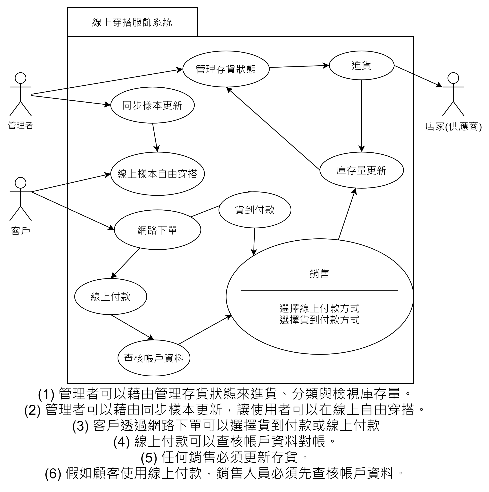

# 主題：線上穿搭服飾商店

### 功能：
* 整合各式電子商店平台商品，像是MUJI、GU等商店，提供使用者一個完整的商品瀏覽介面

* 根據使用者的商品去和VR做結合，提供線上穿搭的功能，減少消費者購物後的尺寸或是風格不搭等問題 

## 第九組
學號          |  姓名
------------|:-----
C108118211  | 楊杰吸我懶絕 (組長)
C108118213. | 林彥東
C108118231  | 陳耿名
C108118247  | 陳冠廷

## 工作分配：
工作內容          |  姓名
-------------|:-----
市場調查與分析 | 楊杰羲
資料庫規劃     | 陳冠廷、陳耿名
網頁前端設計   | 林彥東
網頁後端開發   | 陳耿名、林彥東
文書處理      | 陳冠廷
報告        | 楊杰羲
***
## 作業二

## PERT/CPM圖

## 關鍵路徑 1->2->4->6->7->9->10
# 甘特圖

***
## 作業三

## 功能性需求與非功能性需求
功能性需求：
1.整合各大服飾品牌，提供多樣化的選擇及購買。
2.類似線上試衣間，使用者可以自己拖拉衣服樣本來搭配自己是否適合。
3.可在網站上一次購買多家品牌的商品且運費只需付一次（滿額免運）。
非功能性需求：
1.使用性高，使用者可輕易上手。
2.效能，每秒可處理的交易量為1000筆。
3.維護性，隨各大品牌更新線上商品樣本及進貨

## FDD圖

## 需求分析與使用案例圖

## 使用案例說明

***

***

***

***

***

***

***

***

***

***

